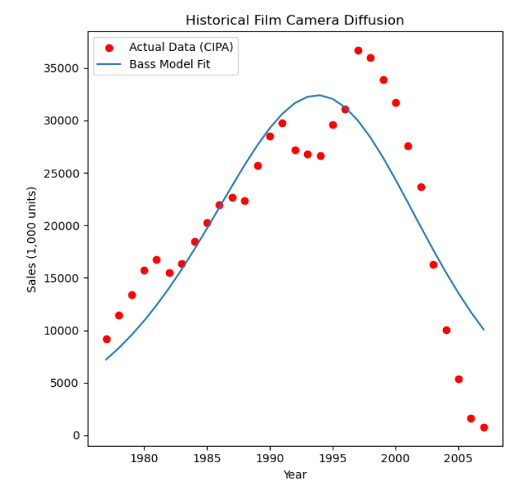

# Innovation Diffusion Analysis: Pentax 17

## 1. Innovation Selection
**Selected Innovation:** Pentax 17 (Half-frame Film Camera)  
**Reference:** [TIME’s Best Inventions of 2024](https://time.com/collection/best-inventions-2024/7094892/pentax-17/)

## 2. Look-alike Innovation and Justification
I have selected **Historical 35mm Film Camera Sales** as the "look-alike" for the Pentax 17.

* **Functionality:** Both products represent 35mm analog technology. While the Pentax 17 is a modern half-frame design, it utilizes the same mechanical mechanisms and chemical film processes as the cameras from the late 20th century.
* **Market Context:** The historical data captures the "Golden Age" and eventual saturation of film. By extracting the $p$ (Innovation) and $q$ (Imitation) coefficients from this era, we can model the inherent social contagion and adoption speed of film photography.

## 3. Historical Data Source
The analysis uses a time series of global film camera shipments (1977–2007) manually extracted from official industry reports.
* **Source:** CIPA (Camera & Imaging Products Association), *Shipment of Film Cameras*.
* **Verification:** A copy of the source PDF report is provided in the `docs/` directory of this repository.

## 4. Bass Model Parameter Estimation
Using the CIPA historical data, I estimated the following parameters:
* **$p$ (Coefficient of Innovation):** 0.010203 (Low value; typical for specialized consumer electronics).
* **$q$ (Coefficient of Imitation):** 0.162198 (High value; indicates adoption is driven by word-of-mouth and trends).
* **$M$ (Historical Market Potential):** 707,311 (units in 1,000s).

## 5. Predictive Strategy (Fermi Logic & Scope)
* **Scope:** Global. The Pentax 17 is distributed internationally to film enthusiasts.
* **Fermi Logic for $M_{pentax}$:** * Estimated global film community: 20 million.
    * Target market share: 25%.
    * **Final $M$:** 5,000 (representing 5,000,000 potential adopters).

## 6. Diffusion Prediction for Pentax 17
Based on the Bass Model simulation:
* **Peak Adoption:** Predicted for **Year 18**, with ~228,990 units sold annually.
* **Market Saturation:** By Year 20, cumulative adopters reach ~3.06 million.

## 7. Estimated Adopters by Period

| Year | Annual Adopters (1000s) | Total Adopters (1000s) |
| :--- | :---: | ---: |
| 1 | 51.02 | 51.02 |
| 5 | 87.52 | 341.42 |
| 10 | 153.48 | 969.84 |
| 15 | 216.54 | 1938.19 |
| 18 | 228.99 | 2618.92 |
| 20 | 220.86 | 3066.36 |
